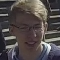

# 📌 Looky

### Low-Resolution Video Super-Resolution based Missing Person Search System

## 🔍 Qualitative Comparison

| Before (Low-Resolution) | After (High-Resolution) |
|:--:|:--:|
|  |  |

## 1. 프로젝트 개요 (Overview)

**Looky**는  
👉 저해상도 CCTV·영상으로부터 **고해상도(HR) 영상**을 복원하고,  
👉 복원된 영상에서 **특정 실종자를 정확히 탐지·식별**하기 위한  
**AI 기반 영상 복원 + 얼굴 인식 파이프라인**이다.

### 핵심 문제의식
- 실제 실종자 수색 환경에서는 영상 화질이 매우 낮음
- 단순 Super-Resolution만으로는 얼굴 식별에 한계 존재
- 따라서 **복원 → 얼굴 복원 → 최종 식별**의 단계적 접근이 필요

---

## 2. 전체 파이프라인 구조

```text
원본 저해상도 영상  
↓ (프레임 분할)  

SwinIR x4 (1차 HR)  
↓  

CodeFormer  
(얼굴 crop → 얼굴 복원 → 원본 프레임 병합)  
↓  

Real-ESRGAN  
(전체 프레임 최종 HR 이미지 생성)  
↓  

이미지 → 영상 재구성  
(HR 프레임을 MP4 영상으로 변환)  
↓  

InsightFace 기반 타겟 얼굴 매칭  
+ Bounding Box 추적
```
---

## 3. 폴더 구조 설명

```bash
Looky/
│
├─ scripts/                    # 파이프라인 단계별 실행 및 설명 문서
│  ├─ 01_pipeline_overview.md  # 전체 파이프라인 개요
│  ├─ 02_swinir_x4.md          # SwinIR x4 Super-Resolution 단계
│  ├─ 03_codeformer_facesr.md  # CodeFormer 기반 얼굴 복원 단계
│  ├─ 04_realesrgan_final.md   # Real-ESRGAN 최종 보정 단계
│  ├─ 04_5_img_to_video.md     # (이미지 → 영상) 단계
│  └─ 05_detection_tracking.md # 얼굴 검출 및 타겟 추적 단계
│
├─ external/                   # 외부 모델 공식 실행 스크립트
│  ├─ imgtovideo.py 
│  ├─ inference_codeformer.py  # CodeFormer 얼굴 복원 추론 스크립트
│  ├─ inference_realesrgan.py  # Real-ESRGAN 최종 업스케일링 스크립트
│  └─ main_test_swinir_tile.py # SwinIR 타일 기반 x4 추론 스크립트
│
├─ detection/                  # 얼굴 인식 및 타겟 매칭 코드
│  ├─ onetarget_multi.py       # 단일 타겟 (reference 여러 장 평균 embedding)
│  └─ multitarget.py           # 다중 타겟 얼굴 인식
│
├─ assets/                     # 결과 시각화 및 예시 파일
│  ├─ photos/
│  └─ videos/           
│
├─ environment.yml             # Anaconda 실행 환경 설정 파일
├─ .gitignore                  
└─ README.md                   

```

---

## 4. Pretrained Models

- **SwinIR x4 (GAN)**  
  Download: https://huggingface.co/mikestealth/SwinIR/blob/main/003_realSR_BSRGAN_DFO_s64w8_SwinIR-M_x4_GAN.pth

- **Real-ESRGAN x4plus**  
  Download: https://huggingface.co/lllyasviel/Annotators/blob/main/RealESRGAN_x4plus.pth

> ⚠️ 사전 학습된 모델은 모두 공식 출처에서 제공된 것이며, 본 저장소에서는 재배포하지 않습니다.

---

## 5. 실행 환경 (Environment)

### 5.1 Anaconda 환경 생성

```bat
conda env create -f environment.yml
conda activate keep_py310
```
⚠️ GPU 환경 권장
CUDA 사용 가능 시 실행 속도가 크게 향상된다.

---

## 6. 데이터셋 및 실험 데이터 설명

### 원본 데이터
- 공개 영상 데이터셋(URL) 사용  
  👉 https://drive.google.com/file/d/1OnaRN2qYhZ2n4rSaNZQJzQPd1Cl2fluk/view
- 원본 영상 길이: **약 35분**

### 본 프로젝트에서의 사용 방식
- 원본 장시간 영상을 그대로 사용하면  
  프레임 분할 시 **이미지 수가 과도하게 증가**하여  
  연산 자원 및 실험 재현성에 부담이 큼
- 따라서 실험 목적에 맞게  
  **약 3초 분량의 구간만 선택**하여 사용
- 해당 구간을 프레임 이미지로 분할한 뒤  
  👉 **총 90장의 프레임 이미지**만을 사용해 실험 수행

⚠️ 저작권 및 용량 문제로  
원본 영상 및 프레임 데이터는 GitHub에 업로드하지 않음

---

## 7. 단계별 실행 방법 (핵심)

### STEP 1. SwinIR x4 (1차 Super-Resolution)
> 저해상도 프레임을 입력으로 받아 1차 HR 프레임을 생성한다.
> 
> 📄 참고 문서: scripts/02_swinir_x4.md

```bat
python main_test_swinir_tile.py ...
```

### STEP 2. CodeFormer (얼굴 복원 + 자동 crop & merge)
> SwinIR 결과 프레임에서 얼굴을 자동으로 검출하여 crop 후 복원하고, 복원된 얼굴을 원본 프레임에 다시 병합한다.<br>
> 내부 과정에서 `cropped_faces`, `restored_faces`, `final_results` 폴더가 자동 생성된다.<br>
>
> 📄 참고 문서: scripts/03_codeformer_facesr.md

```bat
python inference_codeformer.py ^
 -i <SwinIR 결과 폴더> ^
 -o <CodeFormer 출력 폴더> ^
 -w 0.98 ^
 --bg_upsampler none
```

### STEP 3. Real-ESRGAN (최종 HR 프레임 생성)
> CodeFormer 결과 프레임을 입력으로 받아
> 전체 프레임 단위의 최종 HR 영상을 생성한다.
>
> 📄 참고 문서: scripts/04_realesrgan_final.md

```bat
python inference_realesrgan.py ^
 -n RealESRGAN_x4plus ^
 -i <CodeFormer final_results> ^
 -o <최종 HR 결과> ^
 --outscale 1
```

### STEP 3.5 이미지 → 영상 변환 (HR 프레임 → MP4)
> Real-ESRGAN으로 생성된 최종 HR 프레임들을  
> 프레임 순서대로 결합하여 하나의 MP4 영상으로 재구성한다.  
>  
> 생성된 영상은 이후 얼굴 검출 및 타겟 추적 단계의 입력으로 사용된다.
>
> 📄 참고 문서: scripts/04_5_img_to_video.md  
> 🧩 실행 스크립트: external/imgtovideo.py

```bat
python external/imgtovideo.py ^
 --image_folder <최종 HR 프레임 폴더> ^
 --output_video <HR 출력 영상 경로> ^
 --fps 30
```

### STEP 4. 타겟 얼굴 탐지 및 식별 (InsightFace)
>📄 참고 문서: scripts/05_detection_tracking.md

#### (1) 단일 타겟 (reference 이미지 여러 장)

> 여러 장의 reference 얼굴 이미지를 사용하여  
> 평균 embedding을 생성한 뒤 타겟 인물을 탐지한다.

```bat
python detection\onetarget_multi.py
```

#### (2) 다중 타겟

> 여러 명의 타겟 얼굴을 각각 등록하여
> 프레임 내 모든 얼굴과 비교한다.

```bat
python detection\multitarget.py
```

### 판별 기준

- **cosine similarity ≥ threshold** → 🟩 초록 박스 (**FOUND**)
- **cosine similarity < threshold** → 🟥 빨강 박스 (**Unknown**)

---

## 8. Experimental Results

### Experiment 1. Single Reference Image per Target

- **Reference image (1 per target)**  
  

| **Input video (Low-Resolution)** | **Output video (High-Resolution + Detection)** |
|:--:|:--:|
|  |  |

**Description**  
각 타겟당 reference 이미지 1장만 사용하여 저해상도 영상에서 타겟 얼굴 탐지를 수행하였다.  
Super-Resolution 적용 후 얼굴 특징이 개선되어 단일 reference 조건에서도 기본적인 타겟 식별이 가능함을 확인하였다.

---

### Experiment 2. Multiple Reference Images per Target (Single Target)

본 실험에서는 **동일 인물의 여러 각도에서 촬영된 reference 이미지 2장**을 사용하여  
단일 reference 이미지 사용 대비 **타겟 얼굴 탐지 성능 향상 여부**를 확인하였다.

- **Reference images (2 per target)**  

  

| **Input video (Low-Resolution)** | **Output video (High-Resolution + Detection)** |
|:--:|:--:|
|  |  |

**Description**  
단일 reference 이미지 사용 시에는 얼굴 각도, 조명 변화에 따라 타겟 인식 신뢰도가 불안정한 경우가 발생하였다.  
반면, 동일 인물의 서로 다른 각도에서 촬영된 reference 이미지 2장을 사용하여 평균 embedding을 생성한 결과,  
얼굴 방향 변화에도 보다 **안정적인 타겟 얼굴 탐지 성능**을 확인할 수 있었다.

---

### Experiment 3. Multi-Target Face Detection (7 Targets, 1 Reference Each)

본 실험에서는 **총 7명의 서로 다른 인물을 타겟으로 설정**하고, 각 인물당 **reference 이미지 1장씩만 사용**하여  
다중 타겟 얼굴 탐지 성능을 확인하였다.

- **Reference images (7 targets, 1 image per target)**  

<p align="center">
  
  
  
  
  
  
  
</p>

| **Input video (Low-Resolution)** | **Output video (High-Resolution + Detection)** |
|:--:|:--:|
|  |  |

**Description**  
각 인물당 reference 이미지가 1장으로 제한된 조건에서도 Super-Resolution 기반 파이프라인을 통해  
다수의 타겟 얼굴을 동시에 탐지할 수 있음을 확인하였다.  

---

## 💜 Team Members

<table align="center">
  <tr>
    <th>Role</th>
    <th>Member</th>
    <th>Contribution</th>
  </tr>
  <tr>
    <td align="center">
      Team Leader<br/>
      Video Restoration
    </td>
    <td align="center">
      <br/>
      <b>황채원</b><br/>
      <a href="https://github.com/ChaewonHwang-01">ChaewonHwang-01</a>
    </td>
    <td>
      프로젝트 총괄 및 영상 초해상도 파이프라인 설계·구현
    </td>
  </tr>
  <tr>
    <td align="center">
      Object & Face Detection
    </td>
    <td align="center">
      <br/>
      <b>김채원</b><br/>
      <a href="https://github.com/stellarrbs">stellarrbs</a>
    </td>
    <td>
      얼굴·객체 검출 기반 타겟 인식 및 추적 구현
    </td>
  </tr>
</table>
