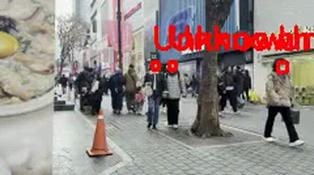
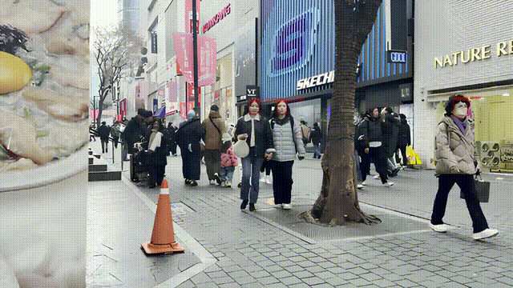

# 📌 Looky

### Low-Resolution Video Super-Resolution based Missing Person Search System

## 🔍 Qualitative Comparison

| Before (Low-Resolution) | After (Super-Resolution) |
|:--:|:--:|
|  |  |

## 1. 프로젝트 개요 (Overview)

**Looky**는  
👉 저해상도 CCTV·영상으로부터 **고해상도(HR) 영상**을 복원하고,  
👉 복원된 영상에서 **특정 실종자를 정확히 탐지·식별**하기 위한  
**AI 기반 영상 복원 + 얼굴 인식 파이프라인**이다.

### 핵심 문제의식
- 실제 실종자 수색 환경에서는 영상 화질이 매우 낮음
- 단순 Super-Resolution만으로는 얼굴 식별에 한계 존재
- 따라서 **복원 → 얼굴 복원 → 최종 식별**의 단계적 접근이 필요

---

## 2. 전체 파이프라인 구조

```text
원본 저해상도 영상
   ↓ (프레임 분할)
SwinIR x4 (1차 HR)
   ↓
CodeFormer (얼굴 crop + 얼굴 복원 + 병합)
   ↓
Real-ESRGAN (전체 프레임 최종 HR)
   ↓
InsightFace 기반 타겟 얼굴 매칭 + Bounding Box
```
---

## 3. 폴더 구조 설명

```bash
Looky/
│
├─ scripts/                    # 파이프라인 단계별 실행 및 설명 문서
│  ├─ 01_pipeline_overview.md  # 전체 파이프라인 개요
│  ├─ 02_swinir_x4.md          # SwinIR x4 Super-Resolution 단계
│  ├─ 03_codeformer_facesr.md  # CodeFormer 기반 얼굴 복원 단계
│  ├─ 04_realesrgan_final.md   # Real-ESRGAN 최종 보정 단계
│  └─ 05_detection_tracking.md # 얼굴 검출 및 타겟 추적 단계
│
├─ external/                   # 외부 모델 공식 실행 스크립트
│  ├─ main_test_swinir_tile.py # SwinIR 타일 기반 x4 추론 스크립트
│  ├─ inference_codeformer.py  # CodeFormer 얼굴 복원 추론 스크립트
│  └─ inference_realesrgan.py  # Real-ESRGAN 최종 업스케일링 스크립트
│
├─ detection/                  # 얼굴 인식 및 타겟 매칭 코드
│  ├─ onetarget_multi.py       # 단일 타겟 (reference 여러 장 평균 embedding)
│  └─ multitarget.py           # 다중 타겟 얼굴 인식
│
├─ assets/                     # 결과 시각화 및 예시 파일
│  └─ videos/            
│
├─ environment.yml             # Anaconda 실행 환경 설정 파일
├─ .gitignore                  
└─ README.md                   

```

---

## 4. Pretrained Models

- **SwinIR x4 (GAN)**  
  Download: https://huggingface.co/mikestealth/SwinIR/blob/main/003_realSR_BSRGAN_DFO_s64w8_SwinIR-M_x4_GAN.pth

- **Real-ESRGAN x4plus**  
  Download: https://huggingface.co/lllyasviel/Annotators/blob/main/RealESRGAN_x4plus.pth

> ⚠️ 사전 학습된 모델은 모두 공식 출처에서 제공된 것이며, 본 저장소에서는 재배포하지 않습니다.

---

---

## 5. 실행 환경 (Environment)

### 5.1 Anaconda 환경 생성

```bat
conda env create -f environment.yml
conda activate keep_py310
```
⚠️ GPU 환경 권장
CUDA 사용 가능 시 실행 속도가 크게 향상된다.

---

## 6. 데이터셋 및 실험 데이터 설명

### 원본 데이터
- 공개 영상 데이터셋(URL) 사용  
  👉 https://drive.google.com/file/d/1OnaRN2qYhZ2n4rSaNZQJzQPd1Cl2fluk/view
- 원본 영상 길이: **약 35분**

### 본 프로젝트에서의 사용 방식
- 원본 장시간 영상을 그대로 사용하면  
  프레임 분할 시 **이미지 수가 과도하게 증가**하여  
  연산 자원 및 실험 재현성에 부담이 큼
- 따라서 실험 목적에 맞게  
  **약 3초 분량의 구간만 선택**하여 사용
- 해당 구간을 프레임 이미지로 분할한 뒤  
  👉 **총 90장의 프레임 이미지**만을 사용해 실험 수행

⚠️ 저작권 및 용량 문제로  
원본 영상 및 프레임 데이터는 GitHub에 업로드하지 않음

---

## 7. 단계별 실행 방법 (핵심)

### STEP 1. SwinIR x4 (1차 Super-Resolution)
> 저해상도 프레임을 입력으로 받아 1차 HR 프레임을 생성한다.
> 
> 📄 참고 문서: scripts/02_swinir_x4.md

```bat
python main_test_swinir_tile.py ...
```

### STEP 2. CodeFormer (얼굴 복원 + 자동 crop & merge)
> SwinIR 결과 프레임에서 얼굴을 자동으로 검출하여 crop 후 복원하고, 복원된 얼굴을 원본 프레임에 다시 병합한다.<br>
> 내부 과정에서 `cropped_faces`, `restored_faces`, `final_results` 폴더가 자동 생성된다.<br>
>
> 📄 참고 문서: scripts/03_codeformer_facesr.md

```bat
python inference_codeformer.py ^
 -i <SwinIR 결과 폴더> ^
 -o <CodeFormer 출력 폴더> ^
 -w 0.98 ^
 --bg_upsampler none
```

### STEP 3. Real-ESRGAN (최종 HR 프레임 생성)
> CodeFormer 결과 프레임을 입력으로 받아
> 전체 프레임 단위의 최종 HR 영상을 생성한다.
>
> 📄 참고 문서: scripts/04_realesrgan_final.md

```bat
python inference_realesrgan.py ^
 -n RealESRGAN_x4plus ^
 -i <CodeFormer final_results> ^
 -o <최종 HR 결과> ^
 --outscale 1
```

### STEP 4. 타겟 얼굴 탐지 및 식별 (InsightFace)
>📄 참고 문서: scripts/05_detection_tracking.md

#### (1) 단일 타겟 (reference 이미지 여러 장)

> 여러 장의 reference 얼굴 이미지를 사용하여  
> 평균 embedding을 생성한 뒤 타겟 인물을 탐지한다.

```bat
python detection\onetarget_multi.py
```

#### (2) 다중 타겟

> 여러 명의 타겟 얼굴을 각각 등록하여
> 프레임 내 모든 얼굴과 비교한다.

```bat
python detection\multitarget.py
```

### 판별 기준

- **cosine similarity ≥ threshold** → 🟩 초록 박스 (**FOUND**)
- **cosine similarity < threshold** → 🟥 빨강 박스 (**Unknown**)
